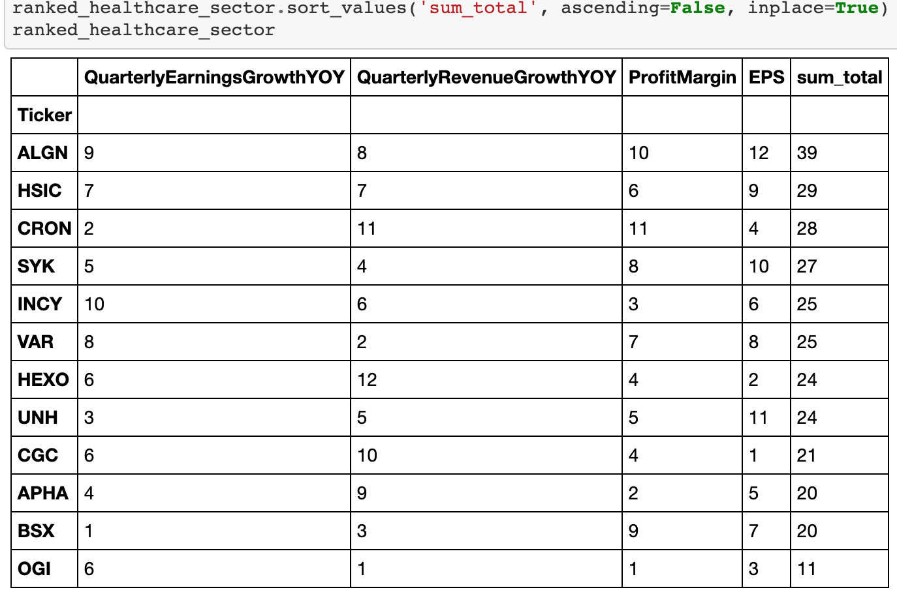

# the-next-market-leaders
Project 1 FIntech 
# Our goal is to identify the best market leaders in 2021 to add to your stock portfolio. 
# We will pull data from several companies across major industries with high growth potential for the coming year.
# We will ask questions such as what is the company's current and past revenue, gross profit, stock price and projected performance.
# From this information, we will identify industry and market leaders with potential to grow exponentially. 
# We look to provide investors with high quality companies that are projected to give high returns based on real time data.

# The Project
## Gathering the Python Modules:
These are the modules that we used to get the data.
 

## Reading In The Data From Files/Databases:
This is how we read-in the data:
1. Stock Tickers Price Data

2. Stock Ticker Company Financial & Summary Data

## Cleaning & Organizing The Ticker & Price Data:

## Resultant Ticker & Price Tables:
- This is the 1st combined dataframe of the stock price & summary info:

## Charts & Analysis:
### (Sum Total column indicates the ranking values)
1. These are the Communications & Consumer Sector Rankings:

2. These are the Energy & Financial Sector Rankings:

3. These are the Tech Sector Rankings:

4. These are the Healthcare Rankings:

5. These are the Industrial Rankings:

### Top Ranking Tickers:
These were the top ranking tickers in each sector:

## Displaying the Charts:

ALGN Candlestick Chart:

ATVI Candlestick Chart:

FB Candlestick Chart:

GRWG Candlestick Chart:

LNG Candlestick Chart:

MAS Candlestick Chart:

QCOM Candlestick Chart:

WTM Candlestick Chart:

ZM Candlestick Chart:

## Final Analysis:
1. All of the top tickers looked to be at a place of strength going into the 1/22 weekend. Each stock was closer to the high of their 2-year high & low range. This favors with the theory of purchasing stock on strength and not from a place of weakness.
2. The rankings of the stocks were based on EPS (earnings per share), quarterly revenue YOY, & profit margin. These 3 measures look to be part of an equation that produces a system of pulling stock tickers that are near a strength within their sector.
3. This is a start in selecting stocks (likely for short-term transactions/options).

