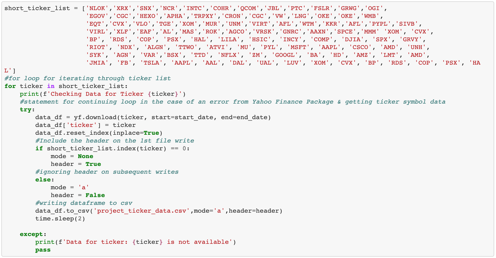

# the-next-market-leaders
Project 1 FIntech 
# Our goal is to identify the best market leaders in 2021 to add to your stock portfolio. 
# We will pull data from several companies across major industries with high growth potential for the coming year.
# We will ask questions such as what is the company's current and past revenue, gross profit, stock price and projected performance.
# From this information, we will identify industry and market leaders with potential to grow exponentially. 
# We look to provide investors with high quality companies that are projected to give high returns based on real time data.

# The Project
## Gathering the Python Modules:
These are the modules that we used to get the data.
 

## Reading In The Data From Files/Databases:
This is how we read-in the data:
1. Stock Tickers Price Data

2. Stock Ticker Company Financial & Summary Data

## Cleaning & Organizing The Ticker & Price Data:

## Resultant Ticker & Price Tables:
- This is the 1st combined dataframe of the stock price & summary info:

## Ranking The Tickers:
1. This is the Communications & Consumer Sector Rankings:

2. These are the Energy & Financial Sector Rankings:

3. This is the Tech Sector Rankings:

## Producing The Top Ticker List:

## Displaying the Charts:

## Final Analysis:

